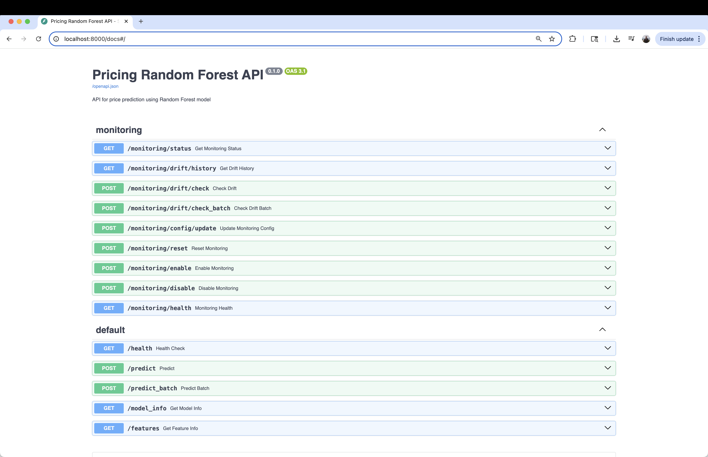
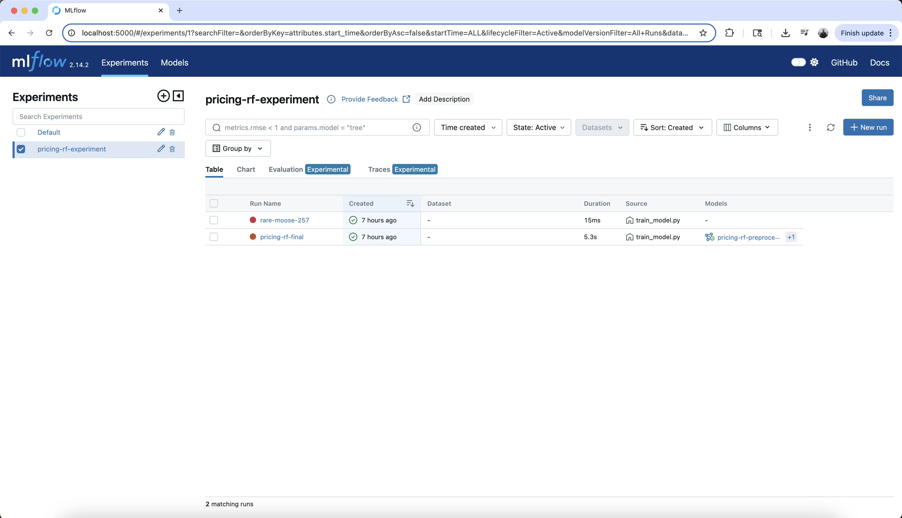
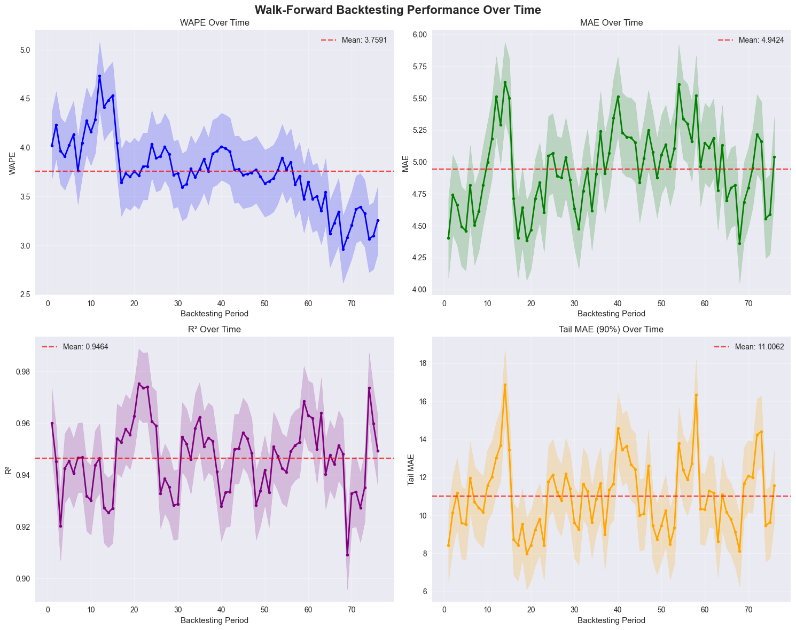
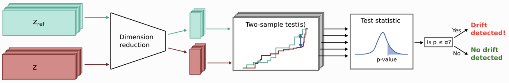

# Pricing Random Forest Model

A comprehensive pricing prediction system built on a Random Forest regressor with production-grade MLOps: real-time drift detection, MLflow tracking/registry, Optuna hyperparameter optimization, and a FastAPI service for low-latency inference. It delivers an end-to-end path from data to deployment with enterprise-ready monitoring and documentation.

## 🎯 Core Objectives
- Price prediction using Random Forest regression
- Production deployment via REST API with monitoring and health checks
- Data-drift detection for live traffic
- MLOps best practices across CI/CD, testing, registry, and dashboards
- Cost-efficient, low-latency serving suitable for scale
- Hooks for underwriting integration and risk-aware decisioning


## 🚀 Live Demo

### FastAPI Interactive Documentation
The service provides comprehensive API documentation with interactive testing capabilities:



### MLflow Experiment Tracking
Monitor model training, hyperparameter optimization, and model registry:



### Walk-Forward Backtesting Performance
Comprehensive backtesting analysis with performance visualization over time:



## 🧱 System Architecture

### Data Pipeline
- **10k synthetic pricing rows** with four base features
- **Feature engineering:** lags, rolling windows, price deltas
- **Automated cleaning, validation, preprocessing**
- **Time-series train/validation/test splits** with as-of joins and leakage controls
- **Ready for orchestration** (e.g., Airflow) for ingest, retraining, and backtests

### Data Science Experimentation Notebooks (EDA → Features → Training)
Curated Jupyter notebooks for EDA, feature engineering, training experimentation, and backtesting. Each notebook calls into the shared `pricing_rf` library (data loaders, feature builders, metrics, Optuna objectives) to ensure reproducibility and parity with production.

**Index:**
- `01_eda.ipynb` (sanity checks, leakage probes)
- `02_feature_prototypes.ipynb` (lags/rolling/deltas, ablations)
- `03_model_dev_rf.ipynb` (Optuna study, MLflow logging & registry)
- `04_backtesting_walk_forward.ipynb` (rolling splits, slice analysis)

### Machine Learning Stack
- **RandomForestRegressor** with Optuna-driven hyperparameter tuning
- **MLflow** for experiment tracking and model registry
- **Target:** ≥90% test accuracy with comprehensive error metrics
- **Walk-forward backtesting** and slice analysis (grade, liquidity, high-value tail)
- **Optional uncertainty bands** (quantile/conformal) to inform downstream decisions

### FastAPI for Low-Latency Inference
- **In-process model & preprocessor:** loaded once on startup and kept warm in memory
- **Async I/O + lightweight validation** (FastAPI/Starlette + Pydantic v2) to minimize overhead
- **Vectorized preprocessing** (NumPy/pandas) and an I/O-free hot path (no registry/storage calls on request)
- **Sampling/frequency-gated drift checks** to protect P50/P95 latency; logs/metrics emitted asynchronously
- **Runtime tuning:** uvicorn workers ≈ CPU cores, uvloop, tuned keep-alives/timeouts; disable compression for small JSON
- **Performance target:** sub-100 ms P50 for single predictions (tunable toward <50 ms with warm model and batch-friendly endpoints)

### Testing System Overview
- **Unit tests:** `test_data.py`, `test_features.py`, `test_model.py`, `test_metrics.py`, `test_training.py`, `test_utils.py`
- **Integration:** `test_service.py` — FastAPI endpoints, model loading, prediction workflows
- **Monitoring:** `test_monitoring.py` — drift detection, alerting, data validation
- **Test types:** unit (components), integration (API workflows), end-to-end (full prediction pipeline)
- **Coverage highlights:** 100% on core schemas and configuration modules
- **Framework:** pytest with coverage reporting and comprehensive assertions
- **Mocking:** MLflow, file I/O, and network calls
- **Data fixtures:** synthetic data for consistent, reproducible environments
- **API testing:** FastAPI TestClient for endpoint validation and error handling
- **Performance:** latency and throughput checks on prediction endpoints
- **Error handling:** exhaustive negative-path scenarios across modules
- **Configuration:** environment variable and YAML config validation
- **Authentication:** JWT validation and IP allowlisting scenarios

### Production Service
- **FastAPI** with autogenerated OpenAPI/Swagger docs
- **MLflow model loading** for consistent inference
- **JWT-based authentication**
- **Real-time drift checks** and alerting
- **AWS-ready containerization** (Docker), scalable and latency-optimized

## 🔎 Key Features

### Data-Drift Detection
- **Real-time evaluation** per prediction or on schedule
- **Methods:** Kolmogorov–Smirnov (KS) and Maximum Mean Discrepancy (MMD)
- **Runtime-configurable thresholds** and frequency
- **Historical drift logs** and trend views
- **Automated alerts** on threshold breaches



The drift detection system compares reference training data (`X_source`) with incoming inference data (`X_target`) through dimensionality reduction and statistical two-sample tests to identify distribution shifts that could impact model performance.

### MLOps Capabilities
- **MLflow runs** with parameters, metrics, artifacts
- **Optuna studies** for automated tuning
- **Centralized model versions** with staged deployment (Staging/Production)
- **Monitoring:** latency, errors, drift scores, model metrics
- **API documentation** available at `/docs`
- **Champion/Challenger support** with shadow/canary rollout and rollback gates

### Production Readiness
- **Async FastAPI endpoints** with Pydantic validation
- **Structured error handling** and centralized logging
- **Liveness/readiness health checks**
- **Single and batch prediction** endpoints
- **Environment-based configuration** management
- **Prediction caching** and profiling for cost reduction at scale

## 🧰 Tech Stack

### Core ML & Data Science
- **scikit-learn ≥ 1.3.0** — classical ML algorithms & utilities · [https://scikit-learn.org/](https://scikit-learn.org/)
- **pandas ≥ 2.0.0** — tabular data manipulation · [https://pandas.pydata.org/](https://pandas.pydata.org/)
- **NumPy ≥ 1.24.0** — n-dimensional arrays & math · [https://numpy.org/](https://numpy.org/)
- **SciPy ≥ 1.10.0** — scientific computing routines · [https://scipy.org/](https://scipy.org/)

### MLflow & Model Management
- **MLflow ≥ 2.8.0** — experiment tracking, registry, model serving · [https://mlflow.org/](https://mlflow.org/)

### Hyperparameter Optimization
- **Optuna ≥ 3.0.0** — automated hyperparameter search · [https://optuna.org/](https://optuna.org/)

### FastAPI & Web Service
- **FastAPI ≥ 0.100.0** — high-performance Python APIs · [https://fastapi.tiangolo.com/](https://fastapi.tiangolo.com/)
- **Uvicorn ≥ 0.20.0** — ASGI server · [https://www.uvicorn.org/](https://www.uvicorn.org/)
- **Pydantic ≥ 2.0.0** — data validation & settings models · [https://docs.pydantic.dev/](https://docs.pydantic.dev/)
- **pydantic-settings ≥ 2.0.0** — 12-factor config via env vars · [https://docs.pydantic.dev/latest/integrations/pydantic_settings/](https://docs.pydantic.dev/latest/integrations/pydantic_settings/)

### Data Processing
- **PyArrow ≥ 10.0.0** — Arrow/Parquet I/O & memory format · [https://arrow.apache.org/](https://arrow.apache.org/)

### Monitoring & Drift Detection
- **alibi-detect ≥ 0.12.0** — data/concept drift detectors · [https://docs.seldon.io/projects/alibi-detect/en/stable/](https://docs.seldon.io/projects/alibi-detect/en/stable/)

### Testing
- **pytest ≥ 7.0.0** — testing framework · [https://docs.pytest.org/](https://docs.pytest.org/)
- **pytest-cov ≥ 4.0.0** — coverage reporting plugin · [https://pytest-cov.readthedocs.io/](https://pytest-cov.readthedocs.io/)

### Code Quality
- **Black ≥ 23.0.0** — opinionated code formatter · [https://black.readthedocs.io/](https://black.readthedocs.io/)
- **Ruff ≥ 0.1.0** — fast Python linter & fixer · [https://docs.astral.sh/ruff/](https://docs.astral.sh/ruff/)

### Jupyter Notebooks
- **Jupyter ≥ 1.0.0** — interactive notebooks · [https://jupyter.org/](https://jupyter.org/)

## Quick Start

> **📋 For detailed setup instructions, see the [Setup Guide](docs/SETUP_GUIDE.md)**

### 1. Installation

```bash
# Clone the repository
git clone <repository-url>
cd price_algo

# Create virtual environment
python -m venv .venv

# Activate virtual environment
source .venv/bin/activate  # macOS/Linux
# or
.venv\Scripts\activate     # Windows

# Install the package and dependencies
pip install -e ".[dev]"

# Install pre-commit hooks (optional)
pre-commit install
```

**Note**: This project has been optimized for distribution. The `.venv` directory and Python cache files have been removed to reduce the project size from ~1.03 GB to 7.5 MB (99.3% reduction). New users will need to create their own virtual environment as shown above.

**Alternative Installation Methods:**

```bash
# Method 1: Using requirements.txt
pip install -r requirements.txt

# Method 2: Using conda
conda create -n pricing-rf python=3.11
conda activate pricing-rf
pip install -e ".[dev]"
```

**Note**: If you don't have Python 3.11+, install it from [python.org](https://python.org) or use conda.

### 2. Setup Data

```bash
# Create sample data
make setup-data

# Or place your data in data/raw.csv
```

### 3. Start MLflow

```bash
# Start MLflow with Docker Compose
make run-mlflow

# Or manually:
cd mlflow && docker-compose up -d
```

### 4. Train Model

```bash
# Run training
make run-train

# Or manually:
python -m src.training.train
```

### 5. Start Service

```bash
# Run FastAPI service
make run-service

# Or manually:
python -m src.service.app
```

## Usage

### Training

The training pipeline includes:
- Data loading and cleaning
- Feature engineering
- Time-based data splitting
- Optuna hyperparameter optimization
- MLflow model registration

```python
from src.pricing_rf.config import Config
from src.training.train import train_model

config = Config()
results = train_model(config)
```

### API Usage

Once the service is running, you can make predictions:

```bash
# Health check
curl http://localhost:8000/health

# Single prediction
curl -X POST "http://localhost:8000/predict" \
     -H "Content-Type: application/json" \
     -d '{"features": {"feature1": 1.5, "feature2": "category_a"}}'

# Batch prediction
curl -X POST "http://localhost:8000/predict_batch" \
     -H "Content-Type: application/json" \
     -d '[{"features": {"feature1": 1.5, "feature2": "category_a"}}]'
```

### Configuration

Configuration is managed through YAML files in `configs/` and environment variables:

```yaml
# configs/data.yaml
raw_data_path: "data/raw.csv"
time_column: "timestamp"
target_column: "price"
categorical_features: ["category_feature"]
numerical_features: ["feature1", "feature2", "feature3"]
```

Environment variables can override YAML settings:
```bash
export DATA_RAW_DATA_PATH="data/my_data.csv"
export TRAIN_N_TRIALS=200
export SERVICE_PORT=8080
```

## Development

### Running Tests

```bash
# Run all tests
make test

# Run with coverage
make test-cov

# Run specific test file
pytest tests/test_features.py
```

### Code Quality

```bash
# Format code
make format

# Run linting
make lint

# Clean build artifacts
make clean
```

### Jupyter Notebooks

```bash
# Start Jupyter server
make notebooks

# Or manually:
jupyter notebook notebooks/
```

## Model Metrics

The model uses several custom metrics for evaluation:

- **WAPE**: Weighted Absolute Percentage Error
- **Tail MAE**: Mean Absolute Error for high-value predictions
- **Directional Accuracy**: Percentage of correct direction predictions
- **Hit Rate**: Percentage of predictions within threshold

## API Endpoints

### Core Endpoints
- `GET /health` - Health check
- `POST /predict` - Single prediction
- `POST /predict_batch` - Batch predictions
- `GET /model_info` - Model information
- `GET /metrics` - Model performance metrics

### Monitoring Endpoints
- `GET /monitoring/status` - Monitoring status and configuration
- `GET /monitoring/drift/history` - Drift detection history
- `POST /monitoring/drift/check` - Manual drift detection
- `POST /monitoring/drift/check_batch` - Batch drift detection
- `POST /monitoring/config/update` - Update monitoring configuration

## Documentation

Comprehensive documentation is available in the `docs/` folder:

- **[Setup Guide](docs/SETUP_GUIDE.md)** - Complete setup instructions for new users
- **[API Usage Guide](docs/API_USAGE_GUIDE.md)** - Complete guide for using the FastAPI service
- **[Model Documentation](docs/MODEL_DOCUMENTATION.md)** - Technical details about the Random Forest model
- **[Monitoring Guide](docs/MONITORING_GUIDE.md)** - Data drift detection and monitoring system
- **[Development Guide](docs/DEVELOPMENT_GUIDE.md)** - Development workflow and best practices
- **[Deployment Guide](docs/DEPLOYMENT_GUIDE.md)** - Production deployment instructions

### Quick Links
- **API Service**: http://localhost:8000
- **Interactive Docs**: http://localhost:8000/docs
- **MLflow UI**: http://localhost:5000

## Docker

### MLflow Stack

The MLflow stack includes:
- MLflow Tracking Server
- PostgreSQL database
- MinIO object storage

```bash
cd mlflow && docker-compose up -d
```

### Building Service Image

```bash
# Build Docker image
make docker-build

# Run container
make docker-run
```

## 🔚 End-to-End Summary

This project is an integrated pricing platform—from research notebooks (EDA → features → training) that call a shared `pricing_rf` library, through Optuna + MLflow for standardized experiments and registry handoff, to walk-forward backtesting and slice analysis for robustness. In production, low latency is first-class: a FastAPI service loads the registered model in-process, keeps the pipeline warmed in memory, and runs a hot, I/O-free path for prediction. Real-time drift checks are sampled to protect tail performance, while auth and operational metrics keep serving safe and observable. Costs are managed with caching, profiling, and autoscaling-friendly containers. The result is a coherent, auditable pipeline—data → training → registry → serving → monitoring—engineered to deliver sub-100 ms single-prediction responses under typical loads.

## Contributing

1. Fork the repository
2. Create a feature branch
3. Make your changes
4. Add tests
5. Run the test suite
6. Submit a pull request

## License

This project is licensed under the MIT License - see the LICENSE file for details.

## Acknowledgments

- scikit-learn for machine learning algorithms
- MLflow for model management
- FastAPI for the web service
- Optuna for hyperparameter optimization

